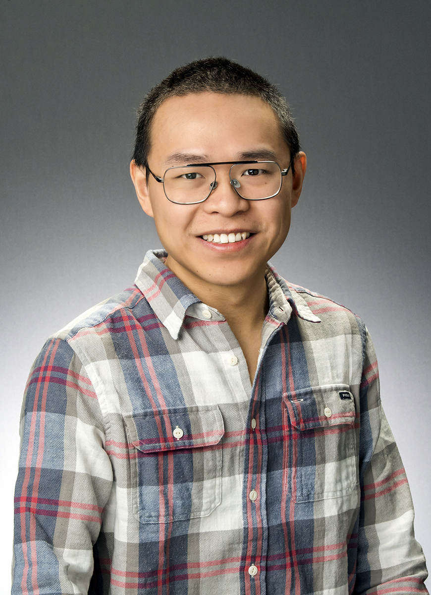

## [Home](../) | [**People**](../people) | [Research](../research) | [Publication](../publication) | [About](../about) | [Artifact](../artifact) 

# Xun Jiao 
[[Curriculum Vitae]](../asset/Xun_Jiao_CV.pdf)

Email: [xun.jiao@villanova.edu](mailto:xun.jiao@villanova.edu) 

**Assistant Professor**, Department of Electrical and Computer Engineering, Villanova University 

**Director**, [Dependable, Efficient, and Intelligent Computing Lab (DETAIL)](https://vu-detail.github.io)

## Short Bio
Dr. Xun Jiao is an assistant professor at the ECE department of Villanova University. He leads the [Dependable, Efficient, and Intelligent Computing Lab (DETAIL)](https://vu-detail.github.io). He earned a dual B.S. degree in electrical engineering from the Joint Program of Queen Mary University of London and Beijing University of Posts and Telecommunications in 2013. He obtained his Ph.D. degree in computer engineering from UC San Diego in 2018 under the supervision of Prof. Rajesh K. Gupta. Dr. Jiao's research interests include resilient computing/AI, approximate computing, AI/machine learning, and software-hardware codesign. He received 6 paper awards/nominations in international conferences such as DATE and EMSOFT. He published 60+ papers in international conferences such as DAC, ICCAD, DATE, and journals such as TCAD, TC, and TNNLS. He is an associate editor of IEEE Trans on CAD, a lead guest editor of Frontiers in Neuroscience, a TPC member of DAC, ICCAD, ASP-DAC, GLSVLSI, LCTES, and a panelist of NSF/DoE. He served as the general chair of DACPS workshop 2023, and web chair for ESWEEK 2023. His research is sponsored by NSF, NIH, L3Harris, and Nvidia. He is the recipient of 2022 IEEE Young Engineer of the Year Award (Philadelphia Section). He has delivered an invited presentation at the U.S. Congressional House. He has close collaboration with industry including Meta, IBM, NXP, and L3Harris. His research is featured in media such as [WIRED](https://www.wired.com/story/hyperdimensional-computing-reimagines-artificial-intelligence/), Quanta Magazine, and Digital Engineering Magazine. His students have won prestigious scholarships such as Knight-Hennessy Scholar and Fulbright Scholar.

<!---
*Fun Fact*:
He has delivered an invited presentation at U.S. Congressional House, which "[received a lot of good feedback from both sides of the aisle](https://www1.villanova.edu/villanova/engineering/newsevents/newsarchives/2020/faculty-research/Sudler-Blockchain.html)".
-->

<!---
## Fun Facts
Born and Raised in [[Nanchang, Jiangxi Province, China]](https://en.wikipedia.org/wiki/Nanchang)

Dog (Sunny) lover:  
[[D.C. National Mall]](https://photos.app.goo.gl/LmGYDaYWviGyqfeW8)  
[[D.C. Cherry Blossoms]](https://photos.app.goo.gl/USZGiBTi3htQSCVr9)  
[[Chicago Skyline]](https://photos.app.goo.gl/DKareugfgCAmetgWA)  
[[Crater Lake]](https://photos.app.goo.gl/VtddnniGVB1cfqoH9)  
[[Philadelphia Winter]](https://photos.app.goo.gl/TKpmeyibXpVa7ff98)  
[[San Diego Balboa Park]](https://photos.app.goo.gl/ujHiFq35odoUhCeg7)  
[[Age < 1]](https://photos.app.goo.gl/RvwjBzn1ZirqjYU19)  
[[First Day at Home]](https://photos.app.goo.gl/x8yXzYkdazxyJVzY7)
-->

